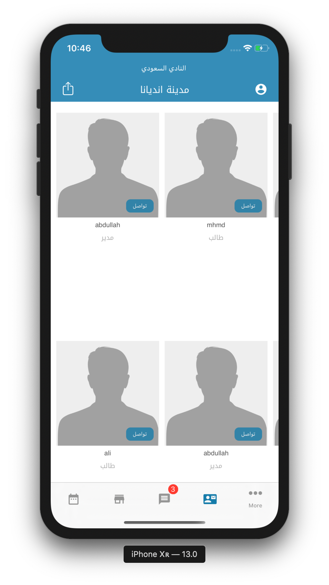
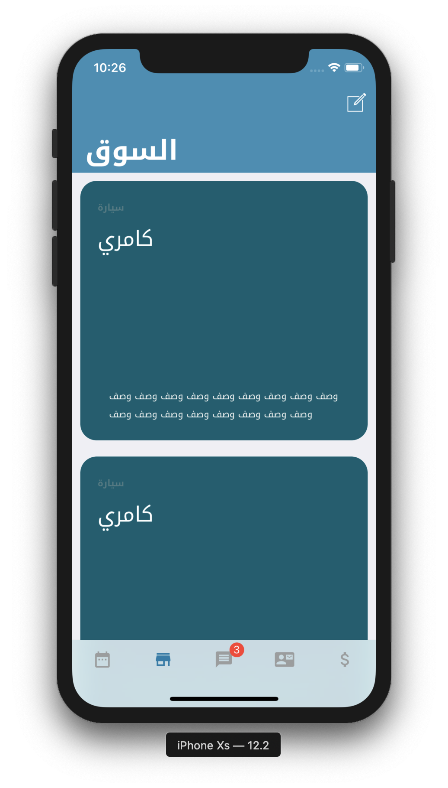

# Saudis in Indy
    
 
       

## Description
This app is a platform developed for Saudi Students in Indianapolis which include:
* A calendar to arrange, register, and follow events happening in the city
* Exchange goods via the marketplace
* Contacting the Saudi student organization leaders via chat

## Built With:

*  [Firebase](firebase.google.com)
    * storage
    * real-time database
    * Cloud function
    * User Authentication
* [Eureka](https://github.com/xmartlabs/Eureka)
* Apple built in libraries
    * UIKit
    * MapKit

## Testing

1. Clone this repository 

`git clone https://github.com/MhndMousa/SaudiStudentAssociation`

2. Navigate to the directory 

`cd ./SaudiStudentAssociation`

3. Open the file with the extension of `SSUAkron.xcworkspace`

To avoid any errors, make sure you change provision profile license to your license and change the Bundle Identifier name to your own identifier 

4. RUN

# License

This project is licensed under the MIT License - see the [LICENSE.md](LICENSE) file for details

