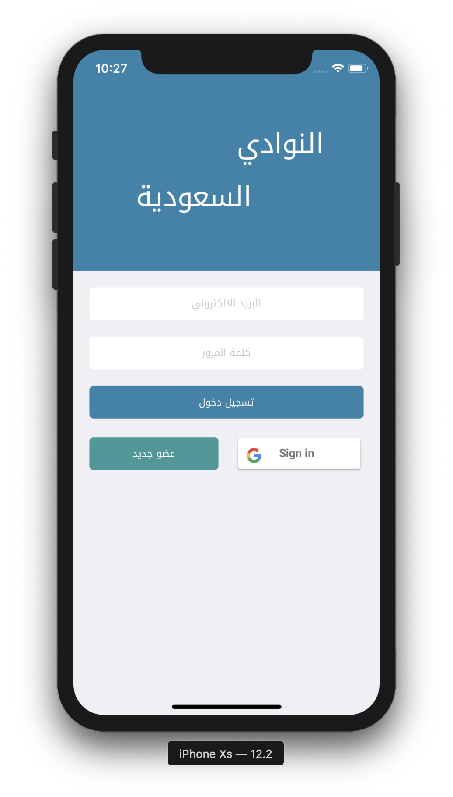
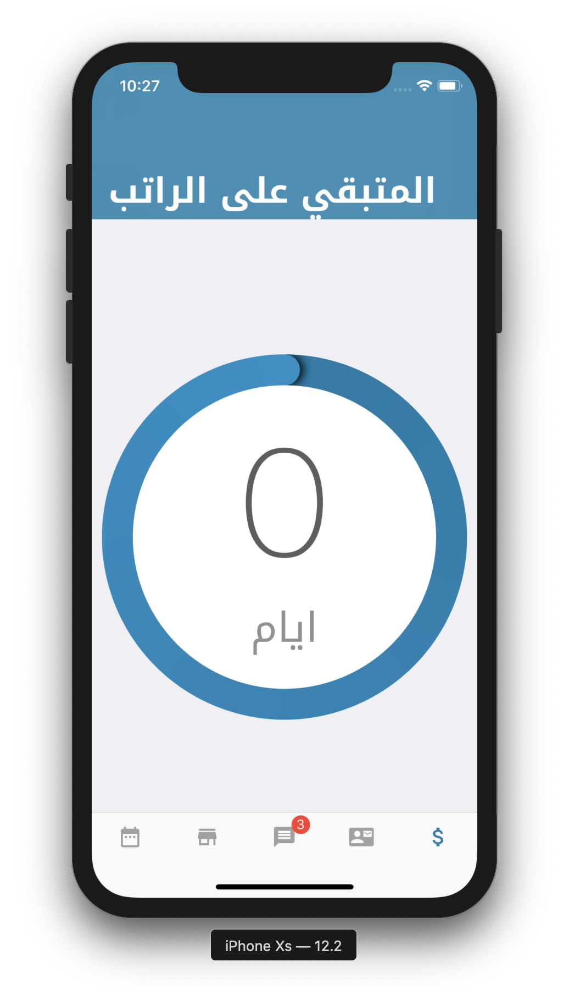

# SaudiStudentAssociation
### Description
This app is a platform developed for Saudi Students in Indianapolis which include:
* A calandert to arrange, register, and follow events happening in the city
* Exchange goods via the marketplace
* Contacting the Saudi student orginazation leaders via chat

### Technologies used:
*  [Firebase](firebase.google.com)
    * storage
    * real-time database
    * Cloud function
    * User Authentication
* [Eureka](https://github.com/xmartlabs/Eureka)
* Apple built in libraries
    * UIKit
    * MapKit

### Testing
1. Clone this repository `git clone https://github.com/MhndMousa/SaudiStudentAssociation`

2. Navigate to the directory `cd ./SaudiStudentAssociation`

3. Open the file with the extention of `SSUAkron.xcworkspace`

To avoid any errors, make sure you change provision profile licence to your licence and change the Bundle identifier name to your own identifier

4. RUN
